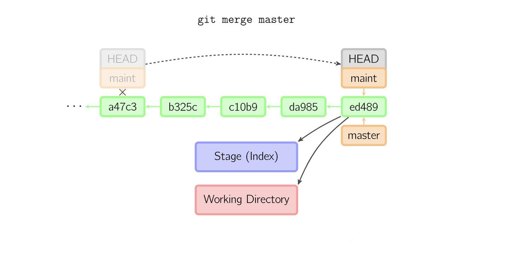
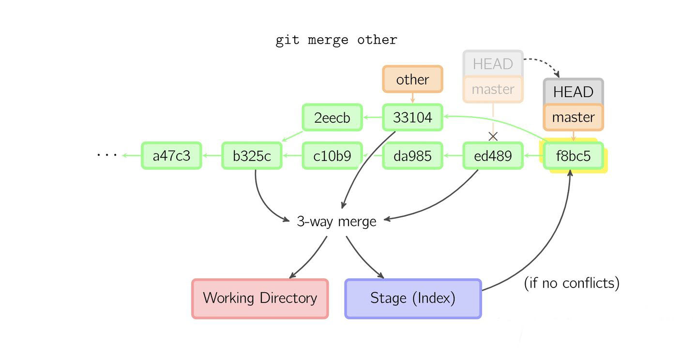
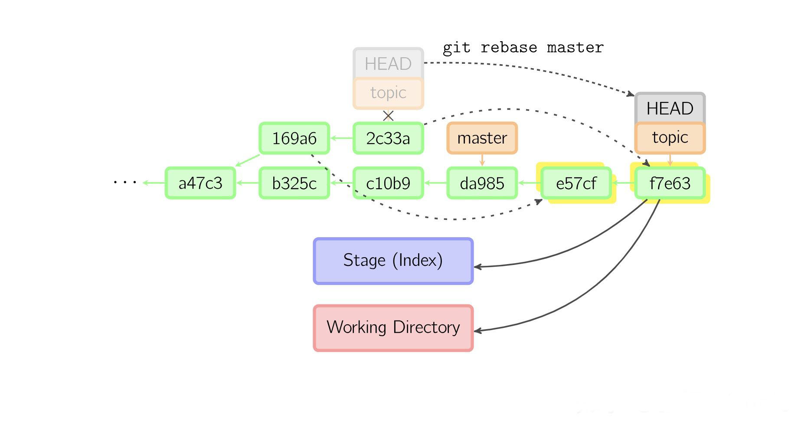
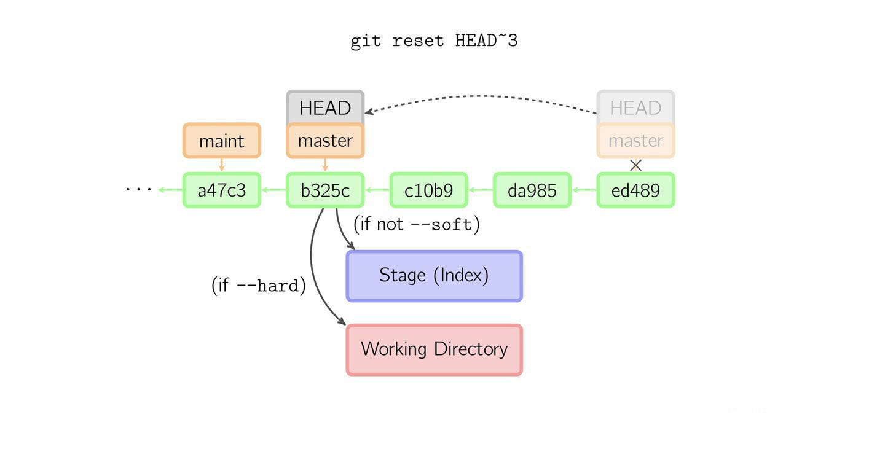
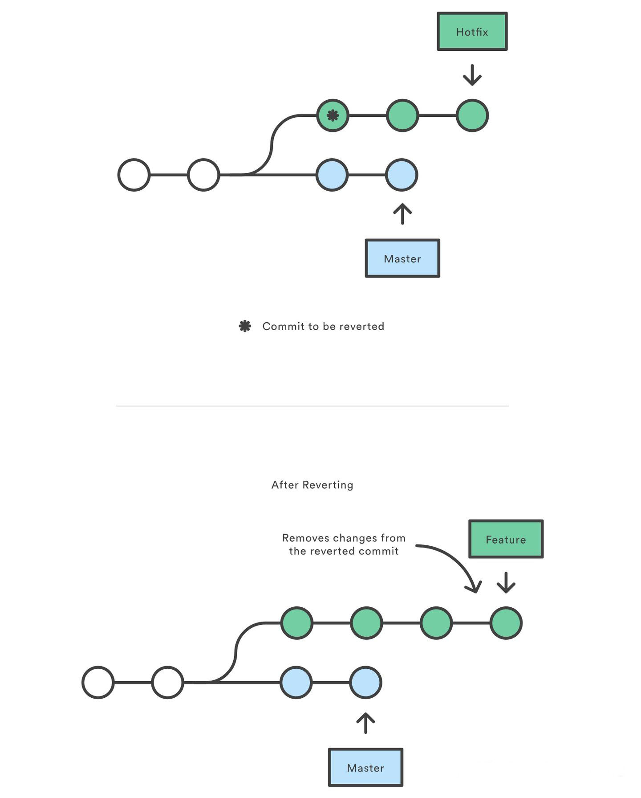

> # 高阶知识
### 基本概念
> 你的本地仓库由 Git 维护的三棵「树」组成。第一个是你的工作目录（Working dir），它持有实际文件，即你所见的；第二个是缓存区（Stage or Index），它像个缓存区域，临时保存你的改动；第三个是提交历史（Commit history），包含的 HEAD 指针指向你最近一次 commit 的引用。

  

上面的四条命令在工作目录、stage 缓存（也叫做索引）和 commit 历史之间复制文件。
```
git add files 把工作目录中的文件加入 stage 缓存
git commit 把 stage 缓存生成一次 commit，并加入 commit 历史
git reset -- files 撤销最后一次 git add files，你也可以用 git reset 撤销所有 stage 缓存文件
git checkout -- files 把文件从 stage 缓存复制到工作目录，用来丢弃本地修改
```

### Merge

git merge 命令把不同分支合并起来。合并前，索引必须和当前提交相同。git merge other 用于将 other 分支上的提交合并到当前分支。

如果另一个分支是当前提交的祖父节点，那么合并命令将什么也不做。另一种情况是如果当前提交是另一个分支的祖父节点，就导致 fast-forward 合并，HEAD 指针只是简单的移动。

  

否则就是一次真正的合并。默认把当前提交（ed489 如下所示）和另一个提交（33104）以及他们的共同祖父节点（b325c）进行一次三方合并。结果是先保存当前目录和索引，然后和父节点 33104 一起做一次新提交。



### rebase

git rebase 是合并命令的另一种选择。merge 把两个分支合并进行一次新提交，提交历史不是线性的。rebase 在当前分支上重演另一个分支的历史，提交历史是线性的。



上面的命令都在 topic 分支中进行，执行 git rebase master 意味着将 topic 分支基于 master 分支进行重演，在 da985 后附加对应于 169a6 和 2c33a 的两次新提交，所以提交历史是线性的。

### rebase & merge 的区别

- git rebase master  

```
A---B topic
/
D---E---F---G master


        A'--B' topic
       /
D---E---F---G master
```
- git merge master

```
A---B topic
/
D---E---F---G master


A---B---H topic
/       /
D---E---F---G master
```
> rebase 最大的好处是你的项目历史会非常整洁的线性，它不像 merge 那样引入不必要的合并提交。但同时，rebase 也会带来两个后果：安全性和可跟踪性。使用时要遵守 rebase 的黄金法则：绝不要在公共的分支上使用它。可跟踪性是指 rebase 不会有合并提交中附带的信息，你看不到 topic 分支中并入了 master 的哪些更改。

### Reset

git reset 命令把当前分支指向另一个位置，并且有选择的变动工作目录和索引。如果你的更改还没有共享给别人，reset 是撤销这些更改的简单方法。当你开发一个功能的时候发现「糟糕，我做了什么？我应该重新来过！」时，reset 就像是 go-to 命令一样。



还可以通过传入参数来修改你的缓存区或工作目录：
```
--soft 缓存区和工作目录都不会被改变
--mixed 默认选项。缓存区同步到你指定的提交，但工作目录不受影响
--hard 缓存区和工作目录都同步到你指定的提交
```
把这些参数想成定义 git reset 操作的作用域就容易理解多了。拿上图举例来说，如果执行 git reset \--soft HEAD\~3，那么文件不会被修改，后三次提交被 git add 添加到暂存区，相当于只撤销了 git commit；git reset \--mixed HEAD\~3 则文件不会被修改，但后三次提交没有添加到暂存区；git reset \--hard HEAD\~3 则文件会被回退到 b325c 时的状态。

### Revert

revert 撤销一个提交的同时会创建一个新的提交。这是一个安全的方法，因为它不会重写提交历史。比如，下图执行git revert HEAD~2会创建一个新的提交来撤销前两个提交的更改，然后把新的提交加入提交历史。



相比 git reset，它不会改变现在的提交历史。因此，git revert 可以用在公共分支上，git reset 应该用在私有分支上。你也可以把 git revert 用作撤销已经 push 的更改，而 git reset 用来撤销已经 commit 但没有 push 的更改，或者 git reset HEAD 撤销没有 commit 的更改。

### References
- git-recipes —— GitHub 8k star 的高质量教程
- Merging vs. Rebasing
- Resetting, Checking Out & Reverting
- https://zhuanlan.zhihu.com/p/44857713
