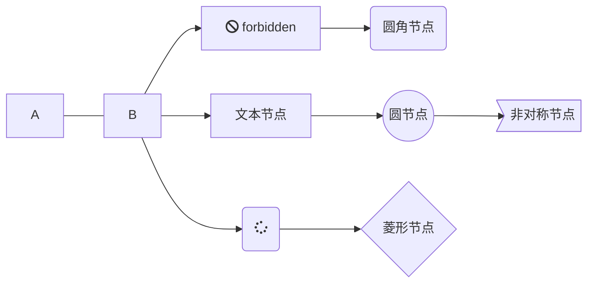
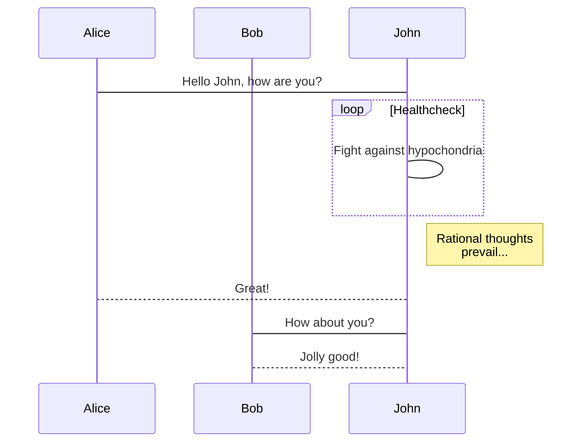
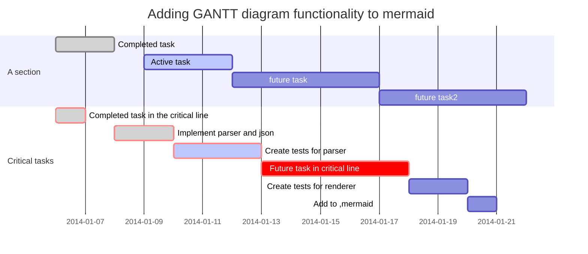

# Markdown 语法

###  一、标题      
` # 这是一级标题 `
# 这是一级标题  
` ## 这是二级标题 `

标题等级以#数量类推

### 二、文字
`**是加粗的文字**`
**这是加粗的文字**  
`*这是倾斜的文字*`
*这是倾斜的文字*  
`***这是斜体加粗的文字***`
***这是斜体加粗的文字***  
`~~这是加删除线的文字~~`
~~这是加删除线的文字~~


### 三、分割线
- 分割线
`------`  或 `*******`
---
----
***
*****
分割线用多个 - * 连接

### 四、图片

语法：
!\[图片alt\](图片地址 ''图片title'')

图片alt就是显示在图片下面的文字，相当于对图片内容的解释。
图片title是图片的标题，当鼠标移到图片上时显示的内容。title可加可不加
```

```


### 五、超链接
- \[超链接名\](超链接地址 "超链接title")
- \<a href="超链接地址" target="_blank"> 超链接名 \</a>  
title可加可不加
```
[简书](http://jianshu.com)
[百度](http://baidu.com)
<a href="https://www.jianshu.com/u/1f5ac0cf6a8b" target="_blank">简书</a>
```
[简书](http://jianshu.com)
[百度](http://baidu.com)
<a href="https://www.jianshu.com/u/1f5ac0cf6a8b" target="_blank">简书</a>


### 六、引用
>这是引用的内容
>>这是引用的内容
>>>>>>>>>>这是引用的内容
```
>这是引用的内容
>>这是引用的内容
>>>>>>>>>>这是引用的内容
```

### 七、列表
#### 无序列表
语法：
无序列表用 - + * 任何一种都可以

- 列表内容
+ 列表内容
* 列表内容  

```
- 列表内容
+ 列表内容
* 列表内容
```

注意：- + * 跟内容之间都要有一个空格
#### 有序列表
语法：
数字加点

1. 列表内容
2. 列表内容
3. 列表内容

```
1. 列表内容
2. 列表内容
3. 列表内容
```

注意：序号跟内容之间要有空格

#### 列表嵌套

- 1. 无序套有序
  2. 无序套有序2
  3. 无序套有序3
- 1. demo1111
  2. dadasda
  3. 1dadsadsa

```
- 1. 无序套有序
  2. 无序套有序2
  3. 无序套有序3
- 1 demo1111
  2 dadasda
  3 1dadsadsa
```


1. - 有序套无序
   + 大大所
   * 打大按键
2. - 打底裤大
   + 大萨达撒

```
1. - 有序套无序
   + 大大所
   * 打大按键
2. - 打底裤大
   + 大萨达撒
```   


### 八、表格
语法：Markdown 制作表格使用 | 来分隔不同的单元格，使用 - 来分隔表头和其他行。  

```
|  表头   | 表头  |
|  :----  | ----:  |
| 单元格  | 单元格 |
| 单元格  | 单元格 |
```

|  表头   | 表头  |
|  :----  | ----:  |
| 单元格  | 单元格 |
| 单元格  | 单元格 |

第二行分割表头和内容。
- 有一个就行，为了对齐，多加了几个
文字默认居左
-两边加：表示文字居中
-右边加：表示文字居右
注：原生的语法两边都要用 | 包起来。

### 九、代码
语法：
单行代码：代码之间分别用一个反引号包起来

	`代码内容`
代码块：代码之间分别用三个反引号包起来，且两边的反引号单独占一行

```
  代码1...
  代码2...
  代码3...
  function fun(){
         echo "这是一句非常牛逼的代码";
    }
  fun();
```

### 十、绘图

有些编辑器不支持流程图,docsify 支持 mermaid 渲染流程图  

- 流程图



```
graph LR
    A --- B
    B-->C[fa:fa-ban forbidden]
    B-->D(fa:fa-spinner)
    C-->F(圆角节点)
    B-->J[文本节点]
    J-->K((圆节点))
    K-->L>非对称节点]
    D-->M{菱形节点}
    ;

 参数说明：
    - TB - top bottom
    - BT - bottom top
    - RL - right left
    - LR - left right
    - TD - same as TB    
```

- 时序图



```
sequenceDiagram
　　　participant Alice
　　　participant Bob
　　　Alice->John:Hello John, how are you?
　　　loop Healthcheck
　　　　　John->John:Fight against hypochondria
　　　end
　　　Note right of John:Rational thoughts <br/>prevail...
　　　John-->Alice:Great!
　　　John->Bob: How about you?
　　　Bob-->John: Jolly good!
```

- 甘特图



```
gantt
　　　dateFormat　YYYY-MM-DD
　　　title Adding GANTT diagram functionality to mermaid
　　　section A section
　　　Completed task　　:done, des1, 2014-01-06,2014-01-08
　　　Active task 　　　　:active, des2, 2014-01-09, 3d
　　　future task 　　　　:　　　  des3, after des2, 5d
　　　future task2　　　　:　　　  des4, after des3, 5d
　　　section Critical tasks
　　　Completed task in the critical line　:crit, done, 2014-01-06,24h
　　　Implement parser and json　　　　　　:crit, done, after des1, 2d
　　　Create tests for parser　　　　　　　:crit, active, 3d
　　　Future task in critical line　　　　　:crit, 5d
　　　Create tests for renderer　　　　　　:2d
　　　Add to ,mermaid　　　　　　　　　　　:1d

```

### 十一、转义
Markdown 支持以下这些符号前面加上反斜杠来帮助插入普通的符号：

\\   反斜线

\`   反引号

\*   星号

\_   下划线

\{\}  花括号

\[\]  方括号

\(\)  小括号

\#   井字号

\+   加号

\-   减号

\.   英文句点

\!   感叹号

```
\\   反斜线

\`   反引号

\*   星号

\_   下划线

\{\}  花括号

\[\]  方括号

\(\)  小括号

\#   井字号

\+   加号

\-   减号

\.   英文句点

\!   感叹号
```


### 十二、Markdown 高级技巧
- 支持的 HTML 元素
不在 Markdown 涵盖范围之内的标签，都可以直接在文档里面用 HTML 撰写。
目前支持的 HTML 元素有：\<kbd> \<b> \<i> \<em> \<sup> \<sub> \<br>等使用


<kbd>Ctrl</kbd>+<kbd>Alt</kbd>+<kbd>Del</kbd> 重启电脑

```
 <kbd>Ctrl</kbd>+<kbd>Alt</kbd>+<kbd>Del</kbd> 重启电脑
```
- 公式  
当你需要在编辑器中插入数学公式时，可以使用两个美元符 $$ 包裹 TeX 或 LaTeX 格式的数学公式来实现。提交后，问答和文章页会根据需要加载 Mathjax 对数学公式进行渲染。
- focsify 支持 katex.js 重新渲染，页面引入：
```
<script src="//cdn.bootcss.com/KaTeX/0.10.0/katex.min.js"></script>
```
渲染效果：
```tex
    E=mc^2
```
